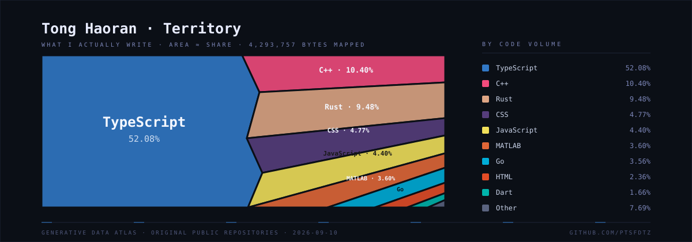

`◈ ATLAS ONLINE` · `📍 NANJING, CHINA` · `🎓 NJTECH` · `🧭 ALWAYS EXPLORING`

---

### ◈ TOOLS OF THE EXPEDITION ◈

### ◈ AI COMPANIONS ON THE MAP ◈

---

## 🏛️ Survey Markers

`🏅 DESKTOP APP ALCHEMIST` · `🤖 AI EXPLORER` · `⚙️ HARDWARE TINKERER` · `🌌 FULL-STACK VOYAGER`

---

## 📐 Language Survey

---

## 📡 Repository Telemetry

---

## 🐍 Contribution Arcade

<picture>
  <source media="(prefers-color-scheme: dark)" srcset="https://raw.githubusercontent.com/ptsfdtz/ptsfdtz/output/github-contribution-grid-snake-dark.svg">
  <source media="(prefers-color-scheme: light)" srcset="https://raw.githubusercontent.com/ptsfdtz/ptsfdtz/output/github-contribution-grid-snake.svg">
  
</picture>

### `INSERT CURIOSITY → WRITE CODE → SHIP MAGIC → REPEAT`

Designed with curiosity, caffeine and a suspicious number of browser tabs.

